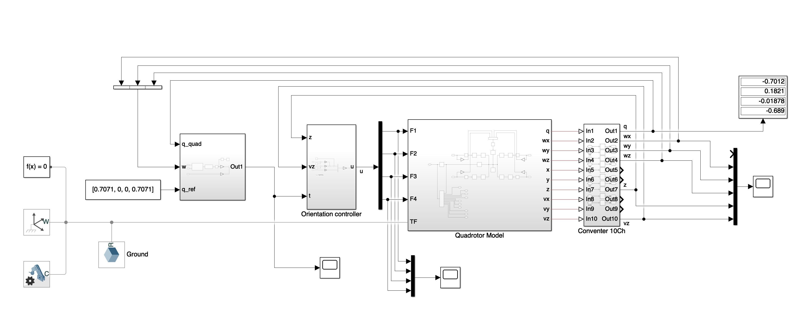
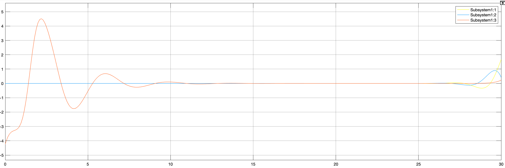
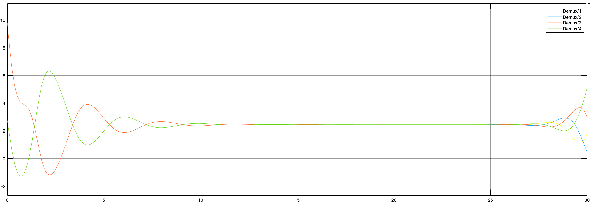

# qcopter
A Matlab + Simulink quadrotor model

## problem 2b solved

Given the quadrotor with ideal motors. 

$$ q_{err} = q_{ref} \otimes q^{*}_{quad} $$

The $ P^2 $ design will always drive the error to zero thanks to the double integrator in the non-linear dynamic

$$ \tau = -P_q q_{1..3}^{err} - P_{\omega} \omega $$

Matlab model 

Torque vector $ [\tau_x, \ \tau_y, \ \tau_z]^T$ plot 

Motor forces plot 

## question 

why system becomes unstable in long term?